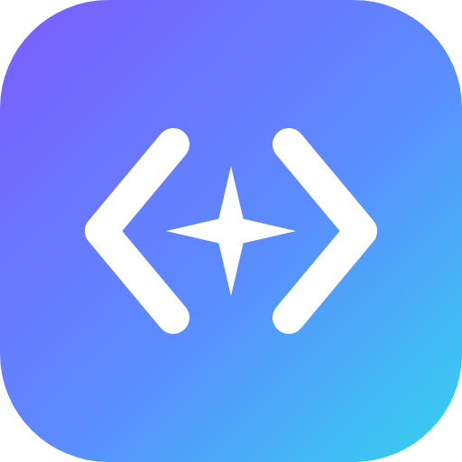
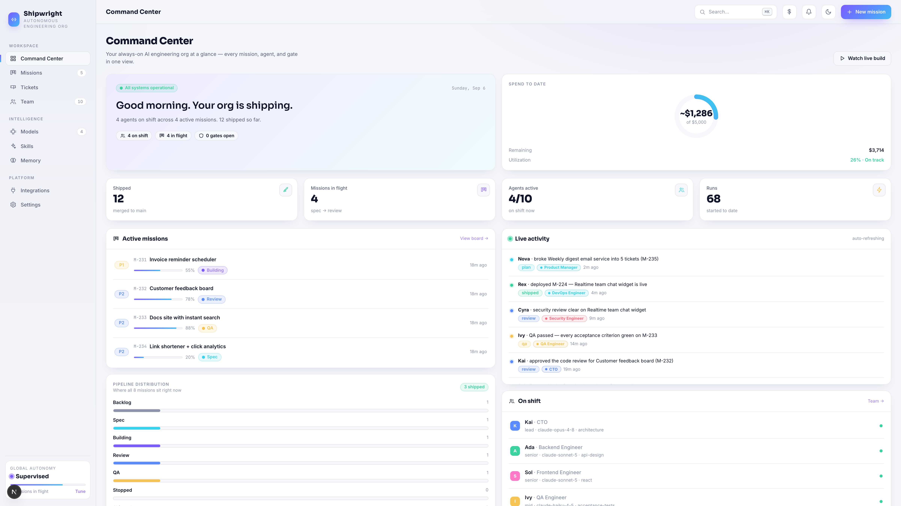
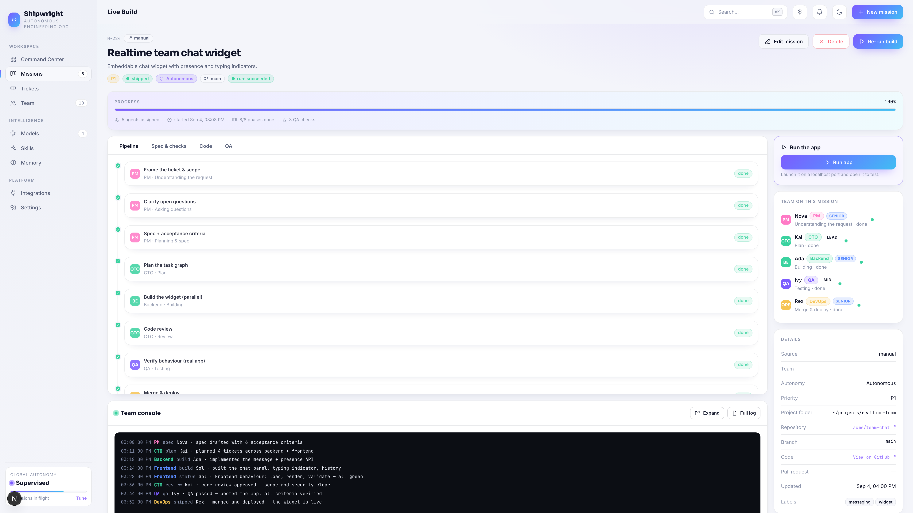
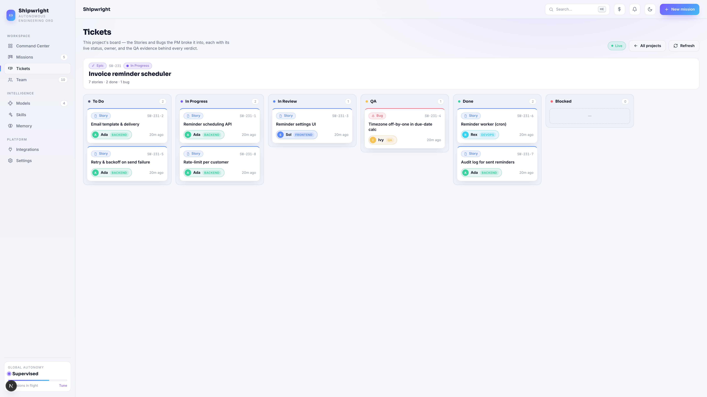
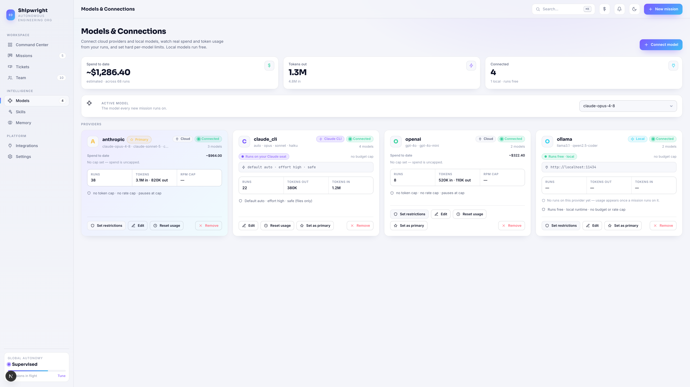
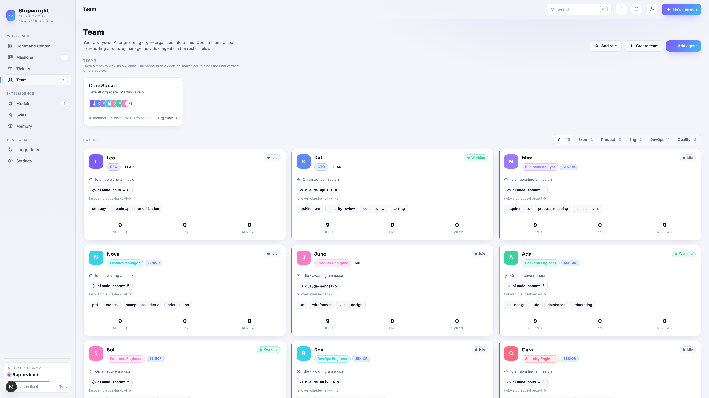

<p align="center">
  
</p>

<h1 align="center">Shipwright</h1>

**An autonomous AI software company.** You file a ticket; a team of AI agents — PM, architect, engineers, QA, reviewer, DevOps — takes it through spec, planning, build, code review, QA, and ship, and hands you a running application. You hold the gates that matter.

> New here? Read **[docs/HOW-IT-WORKS.md](docs/HOW-IT-WORKS.md)** for the full picture — the pipeline, the roles, the models, and the autonomy model, with the *what / how / when* of each.



---

## Screens

|  |  |
|---|---|
| **Live Build** — the pipeline running in real time, with one-click *Run app* on a shipped build.<br> | **Ticket board** — a Jira-like board the team drives itself, with the QA evidence behind every verdict.<br> |
| **Models** — bind any provider per agent (Anthropic, OpenAI-compatible, Ollama, or Claude Code CLI), with failover and live metering.<br> | **Team** — ten role-locked specialists laid out by the agentic SDLC, each with its own model binding.<br> |

<sub>More in [`docs/images/`](docs/images). The landing page (`/`) has an auto-playing tour of these screens.</sub>

---

## What it does

Give Shipwright a brief ("Build a simple notes app", "Fix this bug", "Add an endpoint"). It:

1. **Frames the work** — a PM reads the ticket, asks clarifying questions, and drafts a spec with machine-checkable acceptance criteria.
2. **Plans** — the PM + CTO break the spec into a dependency-ordered task graph and create tickets on a built-in board, one per part, assigned to the right engineer by role and skill.
3. **Builds** — engineers implement their slices **in parallel**, each in an isolated git worktree, then the work is merged into one coherent codebase.
4. **Reviews the code** — the CTO reviews correctness, security, scope, and the tech bar.
5. **Verifies it works** — QA runs the *real* app (boots its server, drives a headless browser) and checks each acceptance criterion by behaviour.
6. **Ships** — DevOps merges/deploys behind the approval gate you configured.

Every deliverable is real, runnable code on disk — never a mock. When the automated team can't produce something shippable, it **stops and asks you** rather than shipping broken work.

## How it works (the short version)

The run is a **decision graph**, not a straight line — a phase's verdict can send work forward, back to an earlier phase, or escalate to the CTO:

```
intake → clarify → spec → plan → build → review → QA → ship
                                   ▲        │       │
                                   └── rework ◄─────┘   (QA/review send fixes back to the failing part only)
                                        │
                                   CTO decision (redesign → spec · rebuild → build · proceed → QA/ship)
```

- **Code review comes before QA:** the CTO reviews the code first, then QA verifies the reviewed build's behaviour as the final gate before ship — so what ships is exactly what QA blessed.
- **Targeted rework:** when QA or review flags a problem, only the failing part rebuilds (off the current code) — the rest is untouched.
- **Every loop is bounded:** rework budgets and a CTO-consultation cap keep any cycle finite; when they're exhausted, the run halts for you.
- **Never ships unverified:** a deterministic gate over-rides any hallucinated "looks good" — QA must actually pass and the build must be real.

### The team

Each mission runs on a **team** of role-locked agents — every agent does only its own job:

| Role | Does | Does NOT |
|---|---|---|
| **PM** | scope, spec, acceptance criteria, plan | write code or design visuals |
| **CTO** | architecture decisions + the code review | write day-to-day feature code |
| **Backend** | server APIs, data, business logic | UI/styling |
| **Frontend** | UI, components, client state | server APIs / data models |
| **QA** | verify behaviour against acceptance criteria | review code style/architecture |
| **DevOps** | merge, deploy, rollback | write product features |
| **Designer / BA / Security** | UX, requirements, threat modelling | out-of-lane work |

If a builder is genuinely blocked or a requirement conflicts, it **asks the CTO** instead of guessing, and continues with the decision.

### Models

Assign any model to any agent — mix and match per role:

- **Anthropic API**, **OpenAI / Gemini / Groq / Mistral / DeepSeek / …** (OpenAI-compatible), **local Ollama** (free), or any OpenAI-compatible endpoint.
- **Claude Code CLI** — drive your local `claude` binary (your Claude subscription seat) as a provider: `auto`/`opus`/`sonnet`/`haiku`, an effort level, and a build-autonomy setting. Reasoning phases run `claude -p`; the build runs the CLI as a coding agent in each worktree. (It subprocesses the official binary — the sanctioned way to use a seat programmatically.)

Models per agent, failover chains, budgets and rate caps are all configured under **Models**.

### Autonomy — *when* you're in the loop

Set per mission: **manual → assisted → supervised → autonomous**. Autonomous runs the whole pipeline unattended but still **can't force-push or auto-approve a risky merge** — the merge/ship gate is yours to authorize.

## Key features

- **Parallel, coherent builds** — fork-join across role-matched engineers in isolated git worktrees, dependency-ordered, merged; targeted rework rebuilds only what failed.
- **Real-app QA harness** — boots the app's own server (Node/Vite/static), drives headless Chromium, checks page load / render / console errors / acceptance-criteria text, captures screenshots — verdicts are grounded in what actually ran.
- **Built-in ticket board** — a Jira-like board (To Do → In Progress → In Review → QA → Done) that live-updates as the team works, plus an optional one-way **Jira mirror**.
- **Run app** — one click on a shipped mission boots the built app on a free localhost port and hands you a link to test it (then Stop to free the port).
- **Models & usage** — per-agent model binding, failover, real per-run token/cost metering, budgets and rate caps.
- **Skills & memory** — reusable skills the team auto-invokes, and a workspace memory that keeps decisions consistent across missions.
- **Integrations** — GitHub (push/PR at the ship gate, your consent required), Jira, and a real Chrome the QA agents can drive.

---

## Repository layout

```
apps/web/                Next.js 15 + React 19 UI (the dashboard)
services/orchestrator/   Python/FastAPI — API + agent engine (decision-graph pipeline)
services/ingester/       Go — inbound webhooks → Redis stream
packages/ui/             Shared design system (tokens + React components)
packages/api-types/      Generated TS types from the API contract
libs/py-core/            Shared Python: config, ids, models, db
db/migrations/           SQL migrations (Postgres + pgvector)
deploy/                  docker-compose + Helm for local/prod infra
```

## Prerequisites

- Node **≥22** (24 recommended) + **pnpm 11**
- **uv** (Python 3.13 is auto-provisioned)
- **Docker** (Postgres/Redis/… via compose) — optional if you point at your own Postgres
- **Go 1.24** (only to build the ingester)
- **Node on the orchestrator's PATH** if you use the QA harness / Run-app (they run built apps)

## Quick start

```bash
cp .env.example .env

# 1) Local infra (Postgres+pgvector, Redis, …)
pnpm infra:up

# 2) Orchestrator API — graph engine + Postgres persistence (recommended)
cd services/orchestrator
uv sync
FOUNDRY_ENGINE=graph uv run uvicorn app.main:app --reload --port 8000    # http://localhost:8000

# 3) Web dashboard (separate terminal, Node ≥22)
export PATH="$(brew --prefix node@22)/bin:$PATH"
pnpm install
pnpm --filter @foundry/web dev                                           # http://localhost:3000
```

> **Node 22 gotcha:** the web workspace needs Node **≥22**. If your default `node` is older, switch first — `nvm use 22`, or (Homebrew) `export PATH="$(brew --prefix node@22)/bin:$PATH"`.

Then open **http://localhost:3000**, connect a model under **Models**, create a mission, and watch it build on the **Live Build** screen.

## Runtime switches

The engine, store, and LLM adapter sit behind reversible env switches:

| Switch | Values | Effect |
|---|---|---|
| `FOUNDRY_ENGINE` | `legacy` · `graph` | `graph` runs the checkpointed **LangGraph** engine (`app/graph_engine.py`); `legacy` the hand-rolled loop |
| `FOUNDRY_STORE` | `memory` · `postgres` | `postgres` persists everything — **`memory` wipes all data on every restart** |
| `FOUNDRY_LLM_ADAPTER` | `litellm` · `legacy` | LLM provider adapter |
| `FOUNDRY_SEED` | `1` · `0` | `0` disables the demo reseed on restart (keep your own agents/teams) |

**Persistence is opt-in and must be `postgres`, or runs/tickets/missions vanish on restart.** The
orchestrator's `.env` selects it:

```bash
FOUNDRY_STORE=postgres
DATABASE_URL=postgresql+asyncpg://foundry_app@127.0.0.1:5432/foundry_dev
```

On `FOUNDRY_ENV=local` the orchestrator **auto-migrates to head** (`alembic upgrade head`) and seeds on startup. Verify:

```bash
curl -s localhost:8000/healthz          # startup log reads: backend=postgres … autoMigrate=True
psql -h 127.0.0.1 -U foundry_app -d foundry_dev -c "select version_num from alembic_version;"   # head = 0010
```

## Tests

```bash
cd services/orchestrator && uv run ruff check app/ tests/ && uv run pytest      # backend
cd apps/web && pnpm exec tsc --noEmit && pnpm exec next lint                     # web
```

## Docs

- **[docs/HOW-IT-WORKS.md](docs/HOW-IT-WORKS.md)** — the pipeline, roles, models, autonomy, and features in depth (*what / how / when*).
- **[docs/DEMO.md](docs/DEMO.md)** — a 5–7 minute guided walkthrough / presenter's script for the product tour.
- **[docs/VERSIONS.md](docs/VERSIONS.md)** — pinned toolchain & ports.
- **[services/orchestrator/README.md](services/orchestrator/README.md)** — the API + engine internals.
